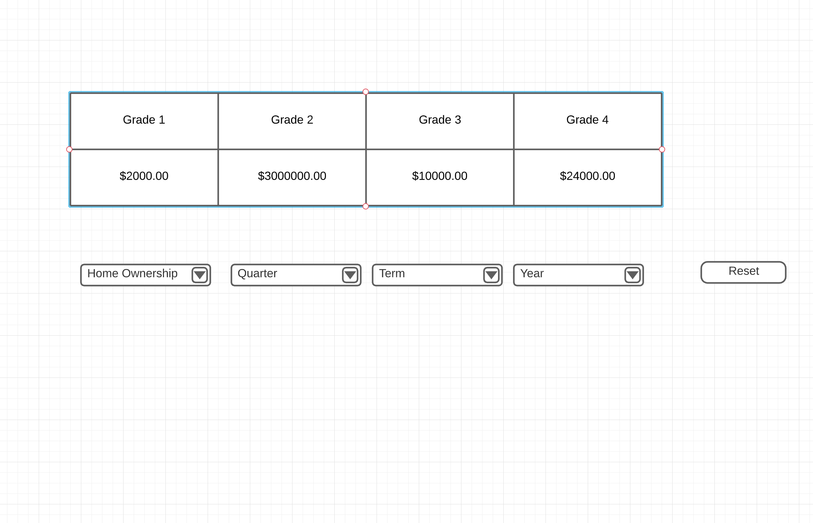

To Run:

`npm install`
`npm start`

@Casey Bennington notes:
    
I ended up choosing to avoid a table library to build out the table because of the combination of data aggregation needed as well as further functionality not being needed.
I chose to use react-multiple-select-dropdown-lite library to create the multiple select dropdowns for filtering because its lightweight and relatively easy to you for this purpose.
Used React.useMemo to memoize some of the data.
I envisioned adding tests when I began this project but ran out of time. This is an item for noted future improvement.
I utilized the papaparse library for the csv file parsing, react-multiple-select-dropdown-lite library for the dropdown functionality, and recharts library to make the chart.


## Challenge

Give an endpoint called `getData` (method is located in `./src/request/api.js`) that returns data with the following data structure:

```json
[
  {
    "currentBalance": "13340.3884795713",
    "grade": "2",
    "homeOwnership": "MORTGAGE",
    "quarter": "4",
    "term": " 36 months",
    "year": "2015"
  },
  {
    "currentBalance": "10254.3896155371",
    "grade": "4",
    "homeOwnership": "RENT",
    "quarter": "3",
    "term": " 36 months",
    "year": "2014"
  }
]
```

1. Create a table (reference `./wireframe/Table.png`), where each column is the unique grade value in the data and the first row is the total aggregation of the current balance for each grade.



2. Build four dropdowns for home ownership, quarter, term and year that will filter out the data and be reflected onto the table. Each dropdown will have unique values that you will need to generate from the data.

3. Create a reset button that resets the data and filter.

4. Please develop as if you're shipping to production.

BONUS POINTS(optional):
Build a Bar graph (reference `./wireframe/Bar Chart.png`) using a library of your choosing, where the x-axis is the loan grouped by grade and the y-axis is the total current balance for each grade. - If you don't know a charting library, we recommend `recharts` which is already included in the package.json

The filter dropdowns should update both the table and bar graph